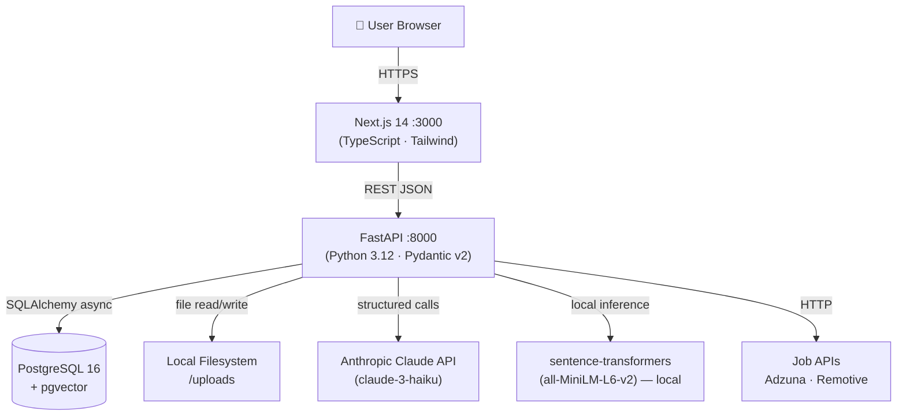
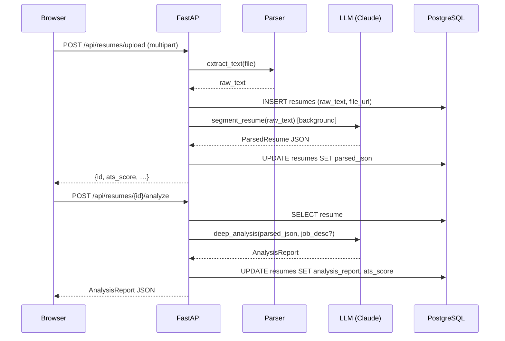

<div align="center">

# 🚀 CareerPilot AI

**AI-powered resume & job application co-pilot**

Upload your resume → get an ATS score, rewritten bullets, live job matches, a tailored cover letter, interview prep questions, and a skill-gap analysis — all in one place.

[](https://github.com/afrit-med-rayan/careerpilot-ai/actions/workflows/ci.yml)


</div>

---

## ✨ Features

| Feature | Description |
|---|---|
| 📄 **Resume Upload** | Upload PDF or DOCX — text is extracted automatically |
| 🎯 **ATS Scoring** | Rule-based + LLM analysis with actionable improvement tips |
| ✍️ **Bullet Rewriting** | STAR-format rewrites powered by Claude, targeted to a job description |
| 💼 **Job Matching** | Live job search via Adzuna & Remotive with semantic similarity scoring |
| ✉️ **Cover Letter** | Tone-aware drafts (formal / conversational / enthusiastic) |
| 🎤 **Interview Prep** | Technical & STAR behavioural questions with response strategy coaching |
| 📊 **Skill Gap Analysis** | Side-by-side coverage score with matched & missing skills |

---

## 🏗️ Architecture



### Request Flow — Resume Upload & Analysis



---

## 🚀 Quick Start

### Prerequisites
- **Docker & Docker Compose** (recommended)
- **Anthropic API key** — required for LLM features (Phase 2+); upload & auth work without it

### 1 · Clone & configure

```bash
git clone https://github.com/afrit-med-rayan/careerpilot-ai.git
cd careerpilot-ai
cp .env.example .env
# Open .env and fill in your ANTHROPIC_API_KEY (and optionally Adzuna credentials)
```

### 2 · Start all services

```bash
docker compose up --build
```

Alembic migrations run automatically on backend startup.

### 3 · Open

| Service | URL |
|---|---|
| Frontend | http://localhost:3000 |
| Backend API docs (Swagger) | http://localhost:8000/docs |
| Backend API docs (ReDoc) | http://localhost:8000/redoc |

### 4 · Seed demo data (optional)

Populates a demo user, 2 sample resumes, 3 job postings, and match records so you can explore the platform without uploading your own resume:

```bash
docker compose exec backend python scripts/seed_demo.py
```

Log in with:
- **Email**: `demo@careerpilot.ai`
- **Password**: `demo1234`

---

## ⚙️ Environment Variables

Copy [`.env.example`](.env.example) and set the values below. All variables have safe defaults for local development except `ANTHROPIC_API_KEY`.

| Variable | Required | Default | Description |
|---|---|---|---|
| `DATABASE_URL` | ✅ | postgres://… | Async SQLAlchemy URL |
| `JWT_SECRET` | ✅ | `changeme` | Long random string for JWT signing |
| `ANTHROPIC_API_KEY` | ✅* | `""` | Claude API key (*required for LLM features) |
| `ADZUNA_APP_ID` | ⬜ | `""` | Adzuna job API ID (Remotive works without it) |
| `ADZUNA_APP_KEY` | ⬜ | `""` | Adzuna job API key |
| `STORAGE_BACKEND` | ⬜ | `local` | `local` or `s3` |
| `LOCAL_UPLOAD_DIR` | ⬜ | `uploads` | Path for local file storage |
| `DEBUG_LOG_LLM` | ⬜ | `false` | Log full LLM prompts & responses |

---

## 🛠️ Development (without Docker)

### Backend

```bash
cd backend
python -m venv .venv
# Windows
.venv\Scripts\activate
# macOS / Linux
source .venv/bin/activate

pip install -r requirements.txt
alembic upgrade head
uvicorn app.main:app --reload --port 8000
```

### Frontend

```bash
cd frontend
npm install
npm run dev        # starts on http://localhost:3000
```

---

## 🧪 Running Tests

### Backend (pytest — 25 tests, all passing)

```bash
cd backend
pytest tests/ -v
```

Tests use an in-memory SQLite database — no running Postgres required.

### Frontend (ESLint + TypeScript)

```bash
cd frontend
npm run lint
npx tsc --noEmit
```

---

## 🔌 API Reference

Full interactive docs at **http://localhost:8000/docs** (Swagger UI).

| Method | Endpoint | Description |
|---|---|---|
| `POST` | `/api/auth/register` | Register a new user |
| `POST` | `/api/auth/login` | Log in, receive JWT |
| `POST` | `/api/resumes/upload` | Upload a PDF/DOCX resume |
| `GET` | `/api/resumes/` | List user's resumes |
| `GET` | `/api/resumes/{id}` | Get resume detail |
| `POST` | `/api/resumes/{id}/analyze` | Run ATS + LLM analysis |
| `POST` | `/api/resumes/{id}/rewrite` | Rewrite bullets (STAR format) |
| `POST` | `/api/resumes/{id}/match-jobs` | Find matching job postings |
| `POST` | `/api/resumes/{id}/cover-letter` | Generate a cover letter |
| `POST` | `/api/resumes/{id}/interview-questions` | Generate interview Q&A |
| `GET` | `/api/resumes/{id}/skill-gap` | Skill gap vs job description |

---

## 📁 Project Structure

```
careerpilot-ai/
├── backend/
│   ├── app/
│   │   ├── api/            # FastAPI routers (auth, resumes)
│   │   ├── core/           # Config, security (JWT, bcrypt)
│   │   ├── db/             # SQLAlchemy models & session
│   │   ├── schemas/        # Pydantic v2 request/response models
│   │   └── services/       # Business logic (LLM, analysis, matching…)
│   ├── alembic/            # Database migrations
│   ├── scripts/            # Utility scripts (seed_demo.py)
│   ├── tests/              # pytest test suite
│   ├── Dockerfile
│   └── requirements.txt
├── frontend/
│   ├── app/                # Next.js 14 App Router pages
│   ├── components/         # Shared UI components
│   └── lib/                # API client (api.ts)
├── .github/workflows/      # GitHub Actions CI
├── docker-compose.yml
└── .env.example
```

---

## 📋 Build Phases

| Phase | Status | What Was Built |
|---|---|---|
| 1 — Foundation | ✅ Done | Scaffold, auth (JWT+bcrypt), resume upload & parsing |
| 2 — Structuring & Analysis | ✅ Done | LLM segmentation, rule-based + AI ATS scoring |
| 3 — Rewriting Engine | ✅ Done | STAR-format bullet rewrites with Claude |
| 4 — Job Matching | ✅ Done | Semantic embeddings + Adzuna / Remotive live jobs |
| 5 — Generation Features | ✅ Done | Cover letter, interview prep coach, skill gap analysis |
| 6 — Polish & Deploy | ✅ Done | Seed script, enhanced CI, full documentation |

---

## ⚠️ Limitations & Future Work

- **OCR**: Scanned (image-only) PDFs are flagged as `ocr_required` but not processed — a future integration point for Tesseract or a cloud OCR API.
- **LinkedIn scraping**: Intentionally excluded for Terms of Service compliance.
- **No auto-apply**: All generated content requires explicit user review and copy-paste — by design.
- **S3 / Cloudflare R2**: The storage abstraction layer is in place; wiring to cloud object storage is a one-line config change.
- **Rate limits**: LLM calls are not rate-limited per user in the current build — add Redis + a token-bucket middleware before deploying to production at scale.

---

## 📄 License

MIT — see [LICENSE](LICENSE).
