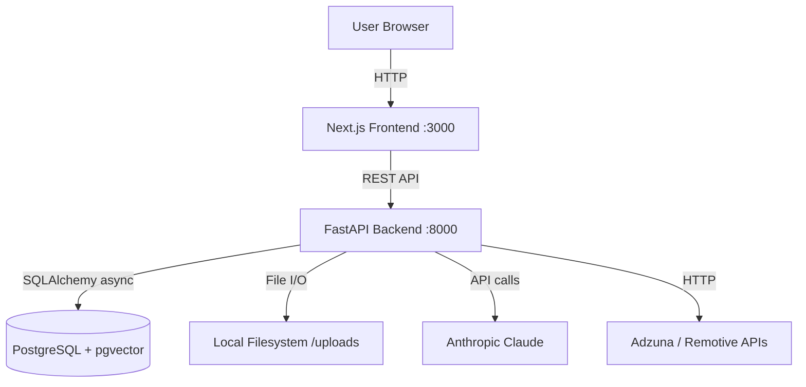

# CareerPilot AI

> AI-powered resume & job application platform — upload your resume and get an ATS score, rewritten bullets, job matches, cover letters, interview prep, and skill-gap analysis.

## Status: Phase 1 Complete ✅

| Phase | Status |
|---|---|
| 1 — Foundation (scaffold, auth, upload, parsing) | ✅ Done |
| 2 — Structuring & Analysis (LLM segmentation, ATS scoring) | 🔜 |
| 3 — Rewriting | 🔜 |
| 4 — Job Matching (embeddings, Adzuna + Remotive) | 🔜 |
| 5 — Generation (cover letter, interview Qs, skill gap) | 🔜 |
| 6 — Polish & Deploy | 🔜 |

---

## Quick Start

### Prerequisites
- Docker & Docker Compose
- An `ANTHROPIC_API_KEY` (required for Phase 2+ LLM features; Phase 1 works without it)

### 1. Clone & configure
```bash
git clone https://github.com/afrit-med-rayan/careerpilot-ai.git
cd careerpilot-ai
cp .env.example .env
# Edit .env and add your ANTHROPIC_API_KEY
```

### 2. Start
```bash
docker compose up --build
```
Postgres migrations run automatically on startup.

### 3. Open
- Frontend: http://localhost:3000
- Backend API docs: http://localhost:8000/docs

---

## Stack

| Layer | Tech |
|---|---|
| Frontend | Next.js 14 · TypeScript · Tailwind CSS |
| Backend | Python · FastAPI · Pydantic v2 |
| Database | PostgreSQL 16 + pgvector |
| ORM | SQLAlchemy 2.0 (async) + Alembic |
| Auth | Email/password + JWT |
| LLM | Anthropic Claude API |
| Embeddings | sentence-transformers (all-MiniLM-L6-v2) — local |
| Job APIs | Adzuna + Remotive (no-key fallback) |

---

## Environment Variables

See [`.env.example`](.env.example) for all variables. Minimum required:

```
DATABASE_URL=postgresql+asyncpg://careerpilot:careerpilot@db:5432/careerpilot
JWT_SECRET=<long random string>
ANTHROPIC_API_KEY=<your key>   # required from Phase 2 onward
```

---

## Development (without Docker)

### Backend
```bash
cd backend
python -m venv .venv
.venv/Scripts/activate  # Windows
pip install -r requirements.txt
alembic upgrade head
uvicorn app.main:app --reload
```

### Frontend
```bash
cd frontend
npm install
npm run dev
```

---

## Running Tests

```bash
# Backend
cd backend
pytest tests/ -v

# Frontend
cd frontend
npm run lint
```

---

## Architecture



---

## Limitations & Future Work

- OCR for scanned PDF resumes is not yet supported (flagged as `ocr_required`)
- LinkedIn scraping is intentionally excluded (ToS compliance)
- No auto-apply — all generated content requires explicit user approval
- S3/R2 storage backend not yet wired (abstraction layer in place)
